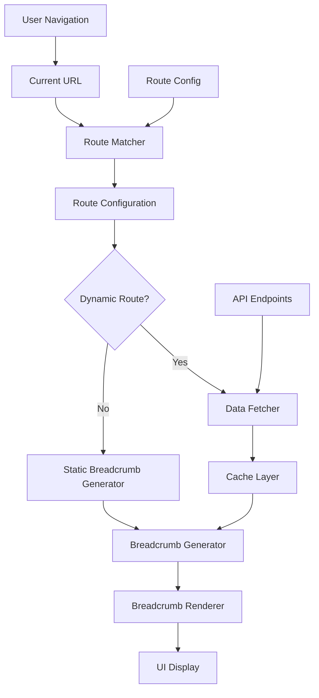

# Centralized Breadcrumb Navigation System - Complete Implementation Guide

## Executive Summary

This document provides a comprehensive overview of the centralized breadcrumb navigation system designed to eliminate manual breadcrumb implementation across the PrepKit application. The system automatically generates breadcrumbs based on URL structure and dynamic data, providing a consistent user experience while reducing development overhead.

## System Overview

### Current State
- Manual breadcrumb implementation in each page
- Inconsistent breadcrumb behavior across routes
- Redundant code and maintenance overhead
- No dynamic data fetching for breadcrumb labels

### Proposed Solution
- Automatic breadcrumb generation based on route patterns
- Centralized configuration for all routes
- Dynamic data fetching with intelligent caching
- Graceful error handling and fallback mechanisms
- Zero-configuration setup for new pages

## Architecture Diagram



## Key Components

### 1. Route Configuration System (`lib/breadcrumb-config.ts`)
**Purpose**: Centralized mapping of URL patterns to breadcrumb structures

**Features**:
- Pattern matching for dynamic routes
- Custom label transformations
- Dynamic data configuration
- Extensible for new routes

**Example Configuration**:
```typescript
{
  pattern: "/learning-paths/[pathId]",
  breadcrumbs: [
    { label: "Dashboard", href: "/dashboard" },
    { label: "Learning Paths", href: "/learning-paths" },
    { label: "", isDynamic: true, dataKey: "title" }
  ],
  dynamicData: {
    endpoint: "/api/paths/{pathId}",
    mapping: { "title": "title" },
    cacheKey: "path-{pathId}"
  }
}
```

### 2. Enhanced Navigation Provider (`components/providers/navigation-provider.tsx`)
**Purpose**: Automatic breadcrumb generation and state management

**Features**:
- Route-based breadcrumb generation
- Dynamic data fetching
- Loading states and error handling
- Performance optimization through caching

**Key Methods**:
- `generateBreadcrumbs()`: Main breadcrumb generation logic
- `fetchDynamicData()`: Handles API calls for dynamic routes
- `handleRouteChange()`: Responds to navigation changes

### 3. Breadcrumb Data Fetcher (`lib/breadcrumb-generator.ts`)
**Purpose**: Efficient data fetching for dynamic breadcrumbs

**Features**:
- Intelligent caching (5-minute TTL)
- Parameter substitution in URLs
- Error handling and retries
- Data mapping and transformation

### 4. Updated Breadcrumb Component (`components/ui/breadcrumb.tsx`)
**Purpose**: Enhanced UI component with loading and error states

**Features**:
- Loading indicators during data fetch
- Error state display
- Accessibility improvements
- Consistent styling

## Route Coverage

### Static Routes
| Route | Breadcrumb | Status |
|-------|-------------|---------|
| `/dashboard` | Dashboard | ✅ Covered |
| `/admin` | Dashboard > Admin | ✅ Covered |
| `/profile` | Dashboard > Profile | ✅ Covered |
| `/jobs` | Dashboard > Jobs | ✅ Covered |
| `/paths` | Dashboard > Browse Paths | ✅ Covered |

### Dynamic Routes
| Route Pattern | Dynamic Data | Breadcrumb | Status |
|---------------|---------------|-------------|---------|
| `/learning-paths/[pathId]` | Path title | Dashboard > Learning Paths > [Title] | ✅ Covered |
| `/lessons/[lessonId]` | Module, Chapter, Lesson | Dashboard > [Module] > [Chapter] > [Lesson] | ✅ Covered |
| `/admin/modules/[moduleId]` | Module title | Dashboard > Admin > Modules > [Title] | ✅ Covered |
| `/admin/learning-paths/[pathId]/schedule` | Path title | Dashboard > Admin > Learning Paths > [Title] > Schedule | ✅ Covered |

## Implementation Benefits

### For Developers
1. **Zero Configuration**: New pages automatically get breadcrumbs
2. **Reduced Boilerplate**: No manual breadcrumb code in components
3. **Centralized Logic**: Single source of truth for navigation
4. **Easy Maintenance**: Update routes in one place
5. **Type Safety**: Full TypeScript support

### For Users
1. **Consistent Experience**: Uniform breadcrumb behavior
2. **Better Performance**: Cached data and smart loading
3. **Error Resilience**: Graceful fallbacks when issues occur
4. **Accessibility**: Proper ARIA labels and keyboard navigation

### For the Business
1. **Faster Development**: Reduced time to implement new features
2. **Lower Maintenance Costs**: Centralized system easier to maintain
3. **Better UX**: Consistent navigation improves user satisfaction
4. **Scalability**: Easy to extend for new route patterns

## Migration Strategy

### Phase 1: Infrastructure Setup (Week 1)
- [ ] Create route configuration system
- [ ] Implement enhanced navigation provider
- [ ] Update breadcrumb component
- [ ] Create new API endpoints
- [ ] Set up testing framework

### Phase 2: Migration (Week 2)
- [ ] Remove manual implementations from existing pages
- [ ] Update provider registration
- [ ] Test all route patterns
- [ ] Verify dynamic data loading

### Phase 3: Testing & Optimization (Week 3)
- [ ] Comprehensive testing across all scenarios
- [ ] Performance optimization
- [ ] Accessibility validation
- [ ] Cross-browser compatibility testing

### Phase 4: Deployment & Monitoring (Week 4)
- [ ] Gradual rollout with feature flags
- [ ] Monitor performance metrics
- [ ] Collect user feedback
- [ ] Address any issues

## Technical Specifications

### Performance Requirements
- API response times: < 200ms
- Cache hit rate: > 80%
- Bundle size impact: < 10KB
- Memory usage: No leaks over extended sessions

### Compatibility Requirements
- Browser support: Chrome, Firefox, Safari, Edge (latest 2 versions)
- Mobile compatibility: iOS Safari, Chrome Mobile
- Screen reader support: NVDA, VoiceOver, JAWS
- Keyboard navigation: Full accessibility compliance

### Security Requirements
- Authentication checks for protected routes
- Parameter validation in API endpoints
- Rate limiting for breadcrumb data requests
- Secure handling of user-specific data

## API Endpoints

### New Endpoints Required
1. **GET `/api/lessons/[lessonId]/breadcrumb`**
   - Returns lesson, chapter, and module titles
   - Requires authentication
   - Response format: `{ title, chapterTitle, moduleTitle }`

2. **GET `/api/paths/[pathId]/breadcrumb`**
   - Returns learning path details
   - Requires authentication
   - Response format: `{ title, emoji, description }`

### Existing Endpoints to Leverage
- `/api/paths/[pathId]` - For learning path data
- `/api/admin/modules/[moduleId]` - For admin module data
- `/api/admin/learning-paths/[pathId]` - For admin path data

## Testing Strategy

### Unit Tests
- Route configuration matching
- Parameter extraction logic
- Data fetching utilities
- Cache functionality

### Integration Tests
- Navigation provider integration
- Breadcrumb component rendering
- API endpoint responses
- Error handling scenarios

### End-to-End Tests
- Complete navigation flows
- Dynamic data loading
- User interaction scenarios
- Cross-browser compatibility

### Performance Tests
- API response times
- Cache effectiveness
- Memory usage monitoring
- Bundle size analysis

## Monitoring & Analytics

### Key Metrics
- Breadcrumb generation time
- API response times
- Cache hit/miss ratios
- Error rates and types
- User interaction patterns

### Alerting
- Performance degradation alerts
- Error rate thresholds
- Cache effectiveness monitoring
- User feedback integration

## Future Enhancements

### Short-term (3-6 months)
1. **User Preferences**: Allow users to customize breadcrumb behavior
2. **Analytics Integration**: Track breadcrumb usage for UX insights
3. **Mobile Optimization**: Better mobile breadcrumb display
4. **Internationalization**: Support for multiple languages

### Long-term (6-12 months)
1. **AI-Powered Labels**: Smart breadcrumb label generation
2. **Contextual Navigation**: Adaptive breadcrumbs based on user behavior
3. **Advanced Caching**: Machine learning-based cache optimization
4. **Voice Navigation**: Voice command support for breadcrumb navigation

## Risk Assessment

### Technical Risks
1. **Performance Impact**: Additional API calls could slow navigation
   - **Mitigation**: Intelligent caching and data optimization
2. **Complexity**: Centralized system may be complex to debug
   - **Mitigation**: Comprehensive logging and monitoring
3. **Breaking Changes**: Migration could introduce bugs
   - **Mitigation**: Gradual rollout with feature flags

### Business Risks
1. **Development Time**: Initial implementation may take longer than expected
   - **Mitigation**: Phased approach with clear milestones
2. **User Adoption**: Changes may confuse existing users
   - **Mitigation**: User testing and gradual rollout

## Success Criteria

### Functional Success
- [ ] All routes display correct breadcrumbs automatically
- [ ] Dynamic data loads and displays properly
- [ ] Navigation works correctly across all scenarios
- [ ] Error handling is graceful and user-friendly

### Performance Success
- [ ] API response times under 200ms
- [ ] Cache hit rate above 80%
- [ ] No performance regression in user experience
- [ ] Minimal impact on bundle size

### Business Success
- [ ] Development time for new pages reduced by 50%
- [ ] Maintenance overhead for navigation reduced by 75%
- [ ] User satisfaction with navigation improved
- [ ] Support tickets related to navigation decreased

## Conclusion

The centralized breadcrumb navigation system represents a significant improvement to the PrepKit application's user experience and developer productivity. By eliminating manual breadcrumb implementation and providing automatic, intelligent navigation, the system will:

1. **Improve User Experience**: Consistent, reliable navigation across all pages
2. **Increase Development Velocity**: Faster implementation of new features
3. **Reduce Maintenance Overhead**: Centralized system easier to maintain
4. **Enhance Scalability**: Easy to extend for future requirements

The comprehensive implementation plan, detailed migration strategy, and thorough testing approach ensure successful deployment and long-term success of the system.

## Next Steps

1. **Review and Approval**: Stakeholder review of this plan
2. **Resource Allocation**: Assign development team members
3. **Timeline Confirmation**: Finalize implementation schedule
4. **Development Kickoff**: Begin Phase 1 implementation
5. **Progress Tracking**: Regular status updates and milestone reviews

This centralized breadcrumb system will transform how navigation is implemented in PrepKit, setting a foundation for future enhancements and providing immediate benefits to both users and developers.