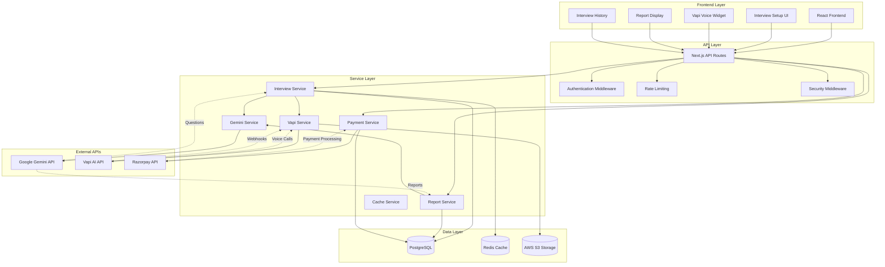
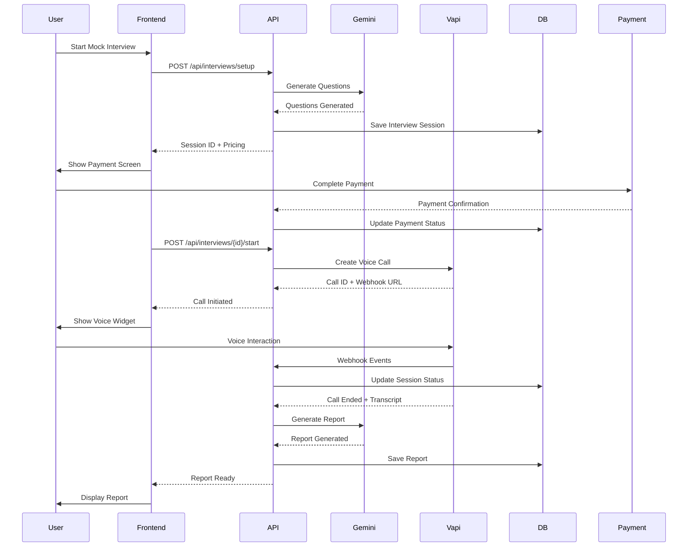
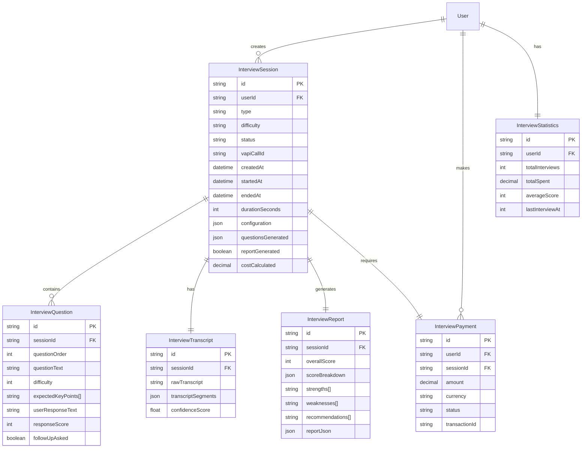
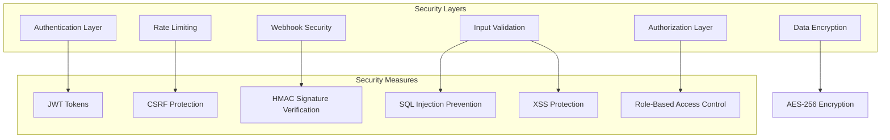
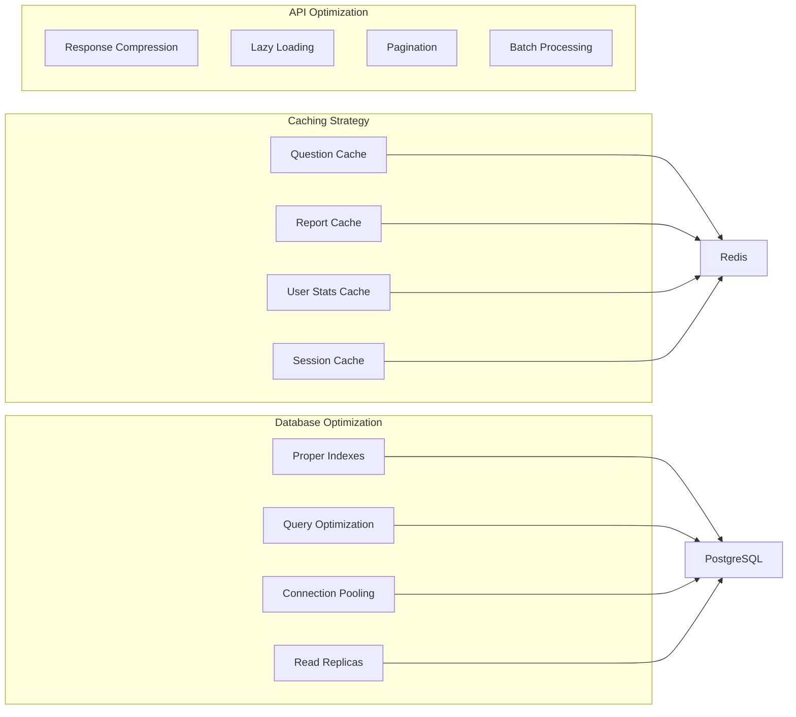
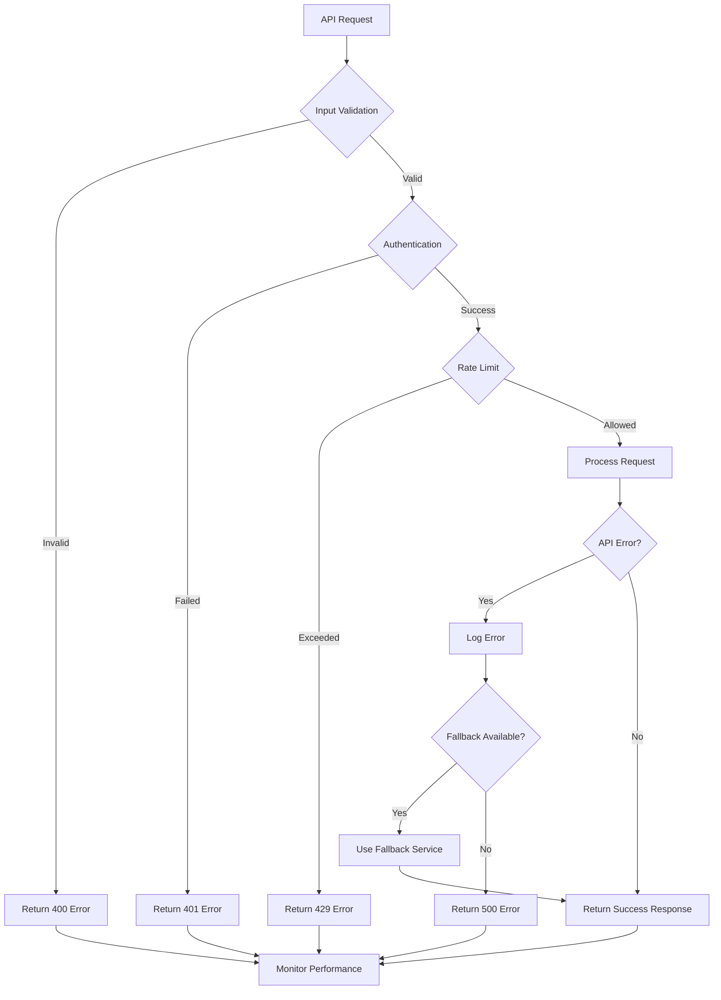
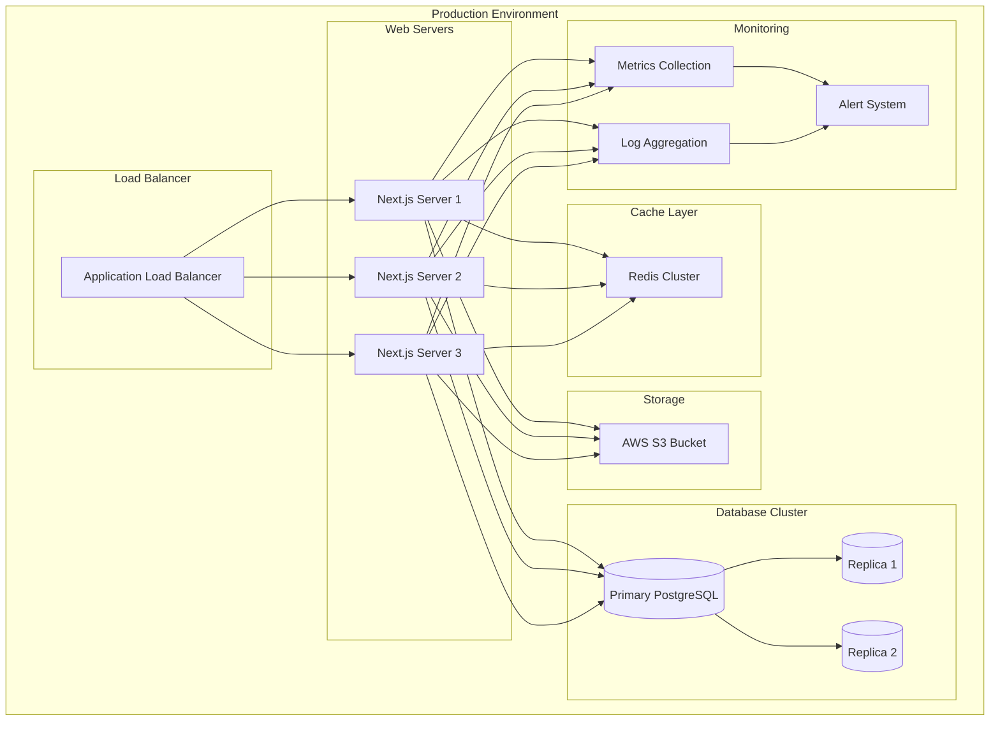

# Mock Interview Feature - Architecture Diagrams

## System Architecture Overview



## User Journey Flow



## Database Schema Relationships



## API Endpoint Structure

```mermaid
graph LR
    subgraph "Interview API"
        Setup[POST /api/interviews/setup]
        Start[POST /api/interviews/{id}/start]
        Complete[POST /api/interviews/{id}/complete]
        Report[GET /api/interviews/{id}/report]
        History[GET /api/interviews/history]
        Delete[DELETE /api/interviews/{id}]
    end

    subgraph "Payment API"
        CreatePayment[POST /api/payments/interview/create]
        VerifyPayment[POST /api/payments/interview/verify]
    end

    subgraph "Webhook API"
        VapiWebhook[POST /api/webhooks/vapi]
    end

    Setup --> CreatePayment
    Start --> VapiWebhook
    Complete --> VapiWebhook
    VapiWebhook --> Report
```

## Component Architecture

```mermaid
graph TB
    subgraph "Frontend Components"
        SetupPage[Interview Setup Page]
        PaymentPage[Payment Page]
        InterviewPage[Interview Session Page]
        ReportPage[Report Page]
        HistoryPage[History Page]
    end

    subgraph "UI Components"
        TypeSelector[Interview Type Selector]
        DifficultySelector[Difficulty Selector]
        FocusAreaSelector[Focus Area Selector]
        VoiceWidget[Voice Interview Widget]
        ScoreDisplay[Score Display]
        FeedbackList[Feedback List]
        RecommendationCard[Recommendation Card]
    end

    subgraph "Service Components"
        QuestionGenerator[Question Generator]
        CallManager[Call Manager]
        ReportGenerator[Report Generator]
        PricingCalculator[Pricing Calculator]
        WebhookHandler[Webhook Handler]
        ErrorHandler[Error Handler]
    end

    SetupPage --> TypeSelector
    SetupPage --> DifficultySelector
    SetupPage --> FocusAreaSelector
    PaymentPage --> PricingCalculator
    InterviewPage --> VoiceWidget
    InterviewPage --> CallManager
    ReportPage --> ScoreDisplay
    ReportPage --> FeedbackList
    ReportPage --> RecommendationCard
    ReportPage --> ReportGenerator

    QuestionGenerator --> GeminiAPI
    CallManager --> VapiAPI
    ReportGenerator --> GeminiAPI
    WebhookHandler --> VapiAPI
```



## Security Architecture



## Performance Optimization



## Error Handling Flow



## Deployment Architecture



## Integration Points

```mermaid
graph LR
    subgraph "External Services"
        Gemini[Google Gemini API]
        Vapi[Vapi AI API]
        Razorpay[Razorpay Payment Gateway]
        Email[Email Service]
        SMS[SMS Service]
    end

    subgraph "Internal Services"
        Auth[NextAuth Service]
        DB[Database Service]
        Cache[Cache Service]
        Storage[Storage Service]
        Monitoring[Monitoring Service]
    end

    subgraph "Integration Methods"
        REST[REST APIs]
        Webhooks[Webhooks]
        SDK[SDKs]
        Queues[Message Queues]
    end

    Gemini --> REST
    Vapi --> REST
    Vapi --> Webhooks
    Razorpay --> REST
    Email --> SDK
    SMS --> SDK

    Auth --> REST
    DB --> REST
    Cache --> REST
    Storage --> REST
    Monitoring --> REST

    REST --> InternalServices
    Webhooks --> Queues